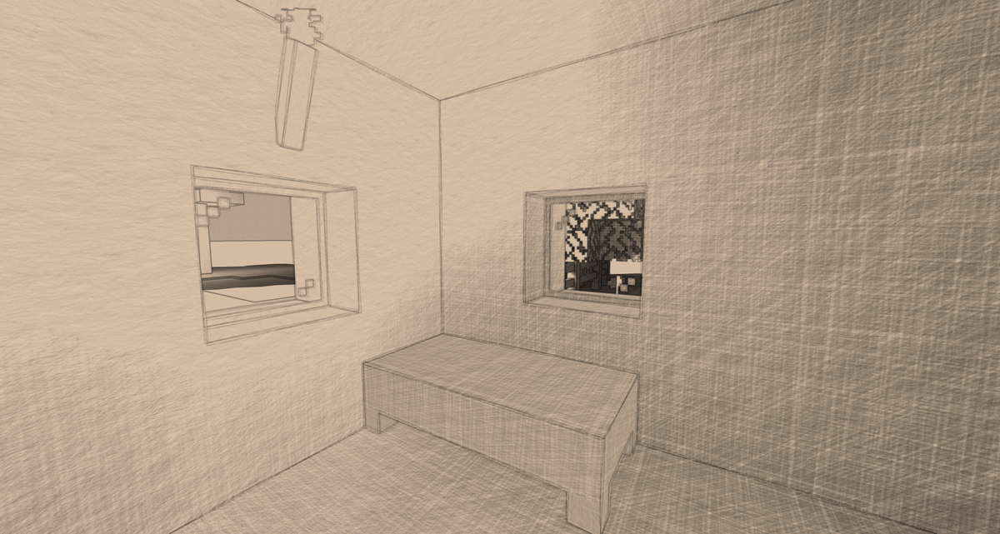
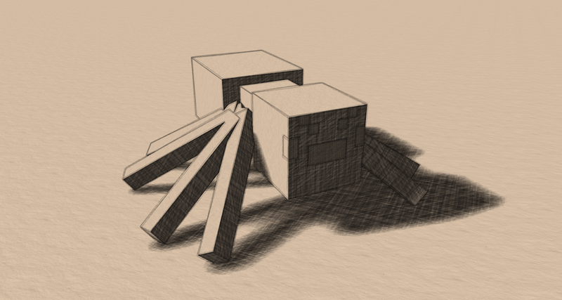
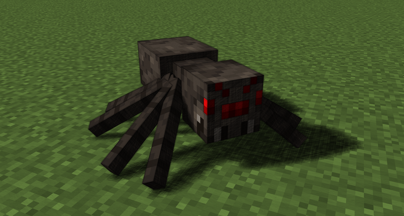

# Optifine Real-Time Pencil Shader

A real-time Minecraft shader pack that gives the game a hand-drawn pencil look. In-game shader settings let you adjust line messiness, crosshatching darkness, and color blending.

**Compatibility:** Tested with Minecraft 1.21.4 and OptiFine 1.21.4_HD_U_J4_pre2.

## Showcase

  

## Alpha blending

The same scene with three different alpha-blend settings:

   
   
  

## Thesis

The shader is described in an [undergraduate thesis in Slovene](https://repozitorij.uni-lj.si/IzpisGradiva.php?id=172856&lang=slv).
